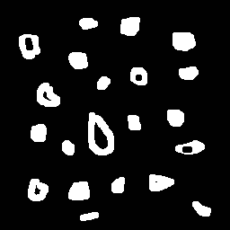
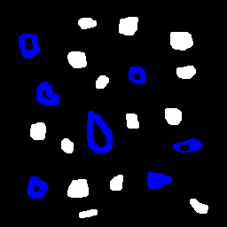
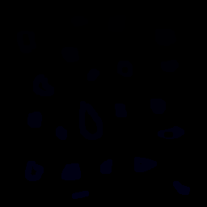

:toc: left

:source-highlighter: pygments

= 3ª Atividade: Identificando Bolhas.

O objetivo dessa atividade é demonstrar, em código, como seria feito caso quiséssemos encontrar objetos em imagens e identificar quais destes contém buracos. 

== Introdução

Para o mundo de processamento de imagens e visão artificial, é muito comum e muito importante que haja a possibilidade de identificar que tipo de objeto e quantos objetos estão presentes em uma cena. 

Peguemos a imagem a seguir:

.Bolhas (Original)
image::./bolhas.png[320,320]

De uma forma simplista e prática, diferentemente dos humanos, máquinas não conseguem processar (sem o uso de algoritmos voltados para isso) e diferenciar quais são os tipos de objetos existentes nessa imagem. Para nós pode parecer fácil saber que há uma quantidade "x" de objetos, dos quais, "y" contém furos (ou buracos) em seu interior, porém, para que uma máquina possa processar esse tipo de informação, faz-se necessário o uso de códigos e funções que faça uma varredura em busca do objetivo. 

== Desenvolvimento da atividade

Nesta atividade, a imagem assume apenas 2 valores de tom de cinza. O fundo com valor "0" (preto) e os objetos com valor "255" (branco). Assim, podemos rotular os objetos presentes na imagem com um valor de tom de cinza que difere cada um.

O papel da função FloodFill é exatamente este. Processar os valores e atribuir um novo valor de tom de cinza ao "aglomerado de pixel" que encontrar - o objeto.

Porém, torna-se falho caso haja um número de objetos superior a 255, uma vez que não haveria mais um valor de tom de cinza para associar a aquele objeto. Assim, faz-se necessário a atualização do algoritmo para uma quantidade maior de objetos (caso haja). Dessa forma, fora implementado um código que reconheça até 16581375 (255x255x255) objetos. Fizemos uso da ideia de que podemos associar em RGB, ou seja, ao invés de apenas 255 tons de cinza, agora temos 255 para o Red, 255 para o Green e 255 para o Blue.

É preciso retirar as "bolhas" que tocam a borda da imagem, uma vez que não podemos identificar se estas realmente são bolhas ou não, se tem buracos ou não. Assim, fora feito o procedimento de retirada desses objetos. A imagem então fica da seginte forma:

.Imagem sem objetos que tocam a borda

Após retirada dos objetos que tocam as bordas, a imagem está preparada para ser tratada, ou seja, contar quantas destas que restaram contém buracos. Mais uma vez, a imagem anterior é modificada:

.Bolhas com buracos

Por fim, podemos perceber abaixo as imagens com o floodfill, ou seja, com cada objeto e sua "identificação".

.Objetos rotulados

=== Código no OpenCV

.bolhas.cpp
[source,cpp,options="nowrap"]
----
include::bolhas.cpp[]
----

O código então retorna um resultado:

Número de bolhas sem buracos: 14

Número de bolhas com buracos: 7

Número total de bolhas: 21

