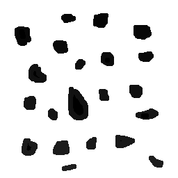

:toc: left

:source-highlighter: pygments

= 3ª Atividade: Identificando Bolhas.

O objetivo dessa atividade é demonstrar, em código, como seria feito caso quiséssemos encontrar objetos em imagens e identificar quais destes contém buracos. 

== Introdução

Para o mundo de processamento de imagens e visão artificial, é muito comum e muito importante que haja a possibilidade de identificar que tipo de objeto e quantos objetos estão presentes em uma cena. 

Peguemos a imagem a seguir:

.Bolhas (Original)
image::./bolhas.png[320,320]

De uma forma simplista e prática, diferentemente dos humanos, máquinas não conseguem processar (sem o uso de algoritmos voltados para isso) e diferenciar quais são os tipos de objetos existentes nessa imagem. Para nós pode parecer fácil saber que há uma quantidade "x" de objetos, dos quais, "y" contém furos (ou buracos) em seu interior, porém, para que uma máquina possa processar esse tipo de informação, faz-se necessário o uso de códigos e funções que faça uma varredura em busca do objetivo. 

== Desenvolvimento da atividade

Nesta atividade, a imagem assume apenas 2 valores de tom de cinza. O fundo com valor "0" (preto) e os objetos com valor "255" (branco). Assim, podemos rotular os objetos presentes na imagem com um valor de tom de cinza que difere cada um.

O papel da função FloodFill é exatamente este. Processar os valores e atribuir um novo valor de tom de cinza ao "aglomerado de pixel" que encontrar - o objeto.

A imagem anterior fica assim:

.Bolhas com o floodfill
image::./flood.png[320,320]

Após retirada das bolhas que tocam as bordas e mudança do fundo, a imagem está preparada para ser tratada, ou seja, contar quantas destas que restaram contém buracos. 

.Imagem a ser tratada pelo código de identificação de buraco

=== Código no OpenCV

.bolhas.cpp
[source,cpp,options="nowrap"]
----
include::bolhas.cpp[]
----

