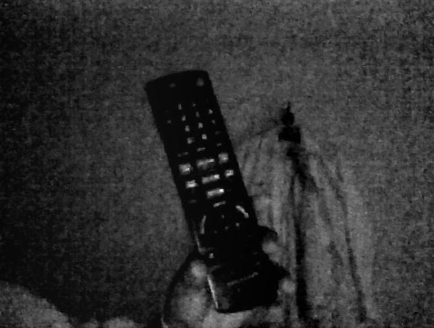

:toc: left
:linkattrs:
:source-highlighter: pygments
:figure-caption: Figura
:listing-caption: Listagem
:toc-title: Sumário
[.text-justify]

= 8ª Atividade: Filtro Homomórfico

== Introdução

O filtro dito como homomórfico é baseado nos princípios de iluminância e reflectância - conceitos já vistos antes na disciplina - para a realização da filtragem.
Matematicamente falando, podemos mostrar a seguinte relação:
f(x,y) = i(x,y)r(x,y)
Do qual, o "i" (iluminância) representa as variações espaciais lentas, ditas de baixas frequências, e o "r"(reflectância) representa as variações espaciais rápidas, ditas de altas frequências.

A iluminância representa a quantidade de luz incidente sobre a imagem/pixel. Já a reflectância demonstra quanto dessa luz é refletida e depende da superficie pela qual a luz incide.

O filtro homomórfico promete corrigir a má iluminação da cena. Para que isso seja bem articulado, devemos atuar separadamente nas componentes de iluminância e reflectância, para que possamos atenuar as frequencias baixas (i) e manter as frequências altas (r).

=== Código no OpenCV

O código implementado pode ser visto a seguir:

.equalize.cpp
[source,cpp,options="nowrap"]
----
include::dft.cpp[]
----

=== Resultados

Podemos ver o resultado da aplicação do filtro a seguir:

.Entrada do fitro homomórfico

.Saída do filtro homomórfico.

--
