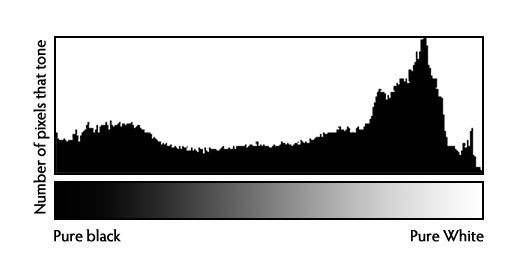
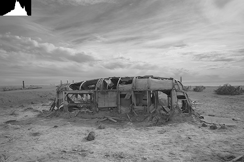
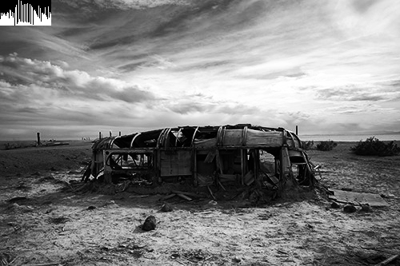
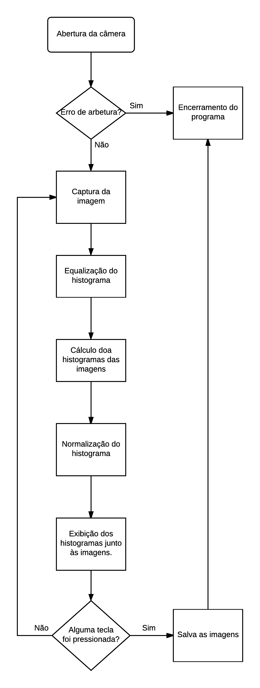

:toc: left
:linkattrs:
:source-highlighter: pygments
:figure-caption: Figura
:listing-caption: Listagem
:toc-title: Sumário
[.text-justify]

= 4ª Atividade: Equalizador de histograma

== Introdução

O histograma é uma ferramenta muito importante usada para avaliar o comportamento de uma imagem. Quando precisamos identificar quantas ocorrencias - de pixels - existem em cada nível (de tom de cinza ou de cor - RBG). Podemos ver na seguite figura, o exemplo de um histograma:

.Exemplo de um histograma

A partir do conhecimento do histograma de uma imagem, podemos analisar algumas características da imagem e, mais que isso, realizar alguns tipos de modificações que melhoram a qualidade da imagem. Dentre as modificações que podemos realizar, uma bastante comum é a equalização do histograma, que acarreta em efeitos que iremos analisar nessa atividade.

== Desenvolvimento da atividade

A atividade propõe mostrar o processo de capturar imagens de uma webcam instalada no computador, calcular os histogramas em tons de cinza e desenhá-los no canto superior esquerdo da imagem capturada. Além disso, em outra janela de exibição, mostrar como cada imagem capturada ficaria com seu histograma equalizado.

Podemos ver o resultado esperado nas seguintes figuras, onde podemos observar as diferenças entre uma imagem e sua versão com o histograma equalizado. No canto superior esquerdo podemos ver o histograma de cada imagem.

.Imagem capturada original

.Imagem capturada equalizada

=== Código no OpenCV

O programa implementado apresenta o comportamento indicado pelo seguinte fluxograma:

.Fluxograma seguido pelo programa

Para a realização de equalização, cálculo e normalização do histograma, foram utilizadas funções oferecidas pela biblioteca OpenCV. O código do programa pode ser visualizado a seguir:

.equalize.cpp
[source,cpp,options="nowrap"]
----
include::equalize.cpp[]
----

Para a realização do processamento, primeiramente um quadro do vídeo é capturado, e após isso, a imagem é invertida, para que haja uma interação melhor com o usuário na apresentação do resultado. Nesse momento, a imagem é convertida para tons de cinza.

A equalização do histograma é realizada através da função http://docs.opencv.org/2.4/modules/imgproc/doc/histograms.html?highlight=equalizehist#equalizehist[equalizeHist()]. Essa função recebe uma imagem e armazena o resultado da equalização em outra imagem. Quando o processo de equalização é realizado, os níveis do histograma tendem a se espalharem por todo os valores de tons de cinza. Com isso, há uma normalização no brilho da imagem, aumentando seu contraste.

Após a equalização da imagem, é então calculado o histograma da imagem original e da imagem equalizada. Esse cálculo é necessário para a apresentação do histograma resultante nas imagens. O cálculo é realizado pela função http://docs.opencv.org/2.4/modules/imgproc/doc/histograms.html?highlight=equalizehist#calchist[calcHist()]. Nessa função, fornecemos alguns valores como a imagem a ser analisada, tamanho do histograma, etc, e o resultado do cáculo é armazendo em uma imagem. Para maior detalhamento, consultar a documentação da função fornecida no site do OpenCV. Os histogramas são então normalizados e copiados para suas respectivas imagens.

=== Resultados

Em desenvolvimento...

Com a execução do código, a imagem capturada pela webcam passa a ser apresentada em uma janela, e o resultado da equalização é apresentada em outra janela. Podemos um exemplo da imagem resultante a seguir:

.Imagem capturada pela webcam
image::./imagem_original.png[640,256]

.Imagem com histograma equalizado
image::./imagem_equalizada.png[640,256]

Com isso, podemos perceber que os efeitos da equalização foram obtidos com sucesso, sendo possível observar claramente a diferença entre o histograma da imagem original e da imagem processada.

Dependendo da iluminação do local, a equalização pode ser pouco perceptível, pois o histograma da imagem original já está bem distribuída ao longo de todos os tons de cinza. Podemos ver isso a seguir:

.Imagem capturada pela webcam
image::./imagem_original2.png[640,256]

.Imagem com histograma equalizado
image::./imagem_equalizada2.png[640,256]
