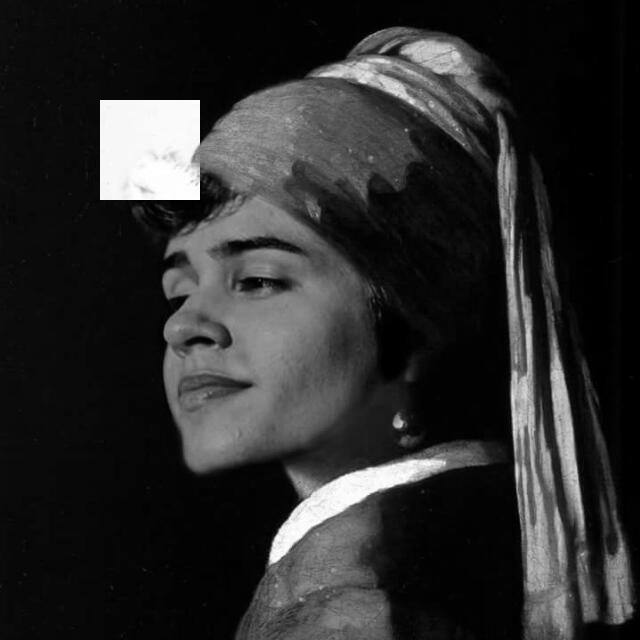

:toc: left

:source-highlighter: pygments

= 1ª Atividade: Negativo de uma imagem.

O objetivo desta atividade é perceber como se aplica o efeito de negativo em imagens digitais em softwares de correção de imagem, utilizando a biblioteca OpenCV.

== Introdução

O negativo, visto em diversas plataformas de edição de imagem, é amplamente utilizado quando se deseja trabalhar em cima de uma figura, modificando-a para, até mesmo, facilidade de análise de detalhes que não seriam vistos em imagens originais. Abaixo podemos ver como seria o tão famoso "negativo":

.Isadora Renascentista (Original em escala de cinza)
image::./neg_pb.png[320,320]

.Isadora Renascentista (Negativo)
image::./negativo.png[320,320]

=== Código no OpenCV

Para mostrar como foi possível obter o negativo da imagem por meio da biblioteca OpenCV, abaixo podemos observar o código que será explicado em breve.

.negativo.cpp
[source,cpp,options="nowrap"]
----
include::regions.cpp[]
----

== Desenvolvimento da atividade

A atividade em questão requer que façamos o negativo de uma imagem, porém, com a interação do usuário que irá informar em que pontos o mesmo deseja ter sua imagem negativada. 

A imagem anterior de Isadora fica assim:

.Isadora Renascentista (Região negativa)

e o código utilizado fora:

.negativo_pontos.cpp
[source,cpp,options="nowrap"]
----
include::regiao.cpp[]
----

Os pontos utilizados foram:

[source,txt,options="nowrap"]
----
include::teste.txt[]
----

