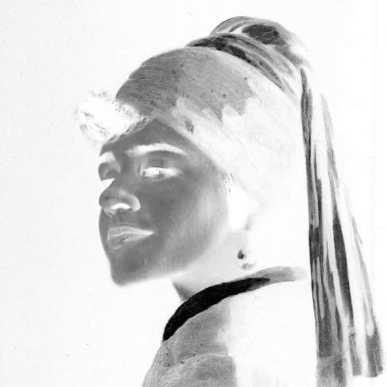
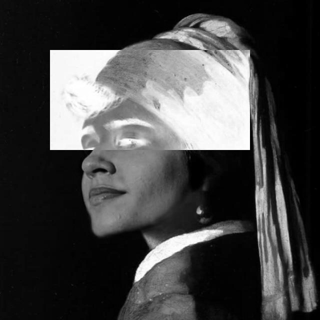

:toc: left
:linkattrs:
:source-highlighter: pygments
:figure-caption: Figura
:listing-caption: Listagem
:toc-title: Sumário
[.text-justify]

= 1ª Atividade: Negativo de uma imagem.

O objetivo desta atividade é manipular os pixels de uma imagem utilizando a biblioteca OpenCV, de tal forma que uma imagem seja processada para ser exibido o seu negativo.

== Introdução

O negativo, visto em diversas plataformas de edição de imagem, é amplamente utilizado quando se deseja trabalhar em cima de uma figura, modificando-a para, até mesmo, facilidade de análise de detalhes que não seriam vistos em imagens originais. Abaixo podemos ver como seria o tão famoso "negativo":

.Isadora Renascentista (Original em escala de cinza)
image::./neg_pb.png[320,320]

.Isadora Renascentista (Negativo)

=== Código no OpenCV

Para mostrar como foi possível obter o negativo da imagem por meio da biblioteca OpenCV, abaixo podemos observar o código que será melhor implementado e explicado em breve.

.negativo.cpp
[source,cpp,options="nowrap"]
----
include::regions.cpp[]
----

Pode-se notar que a implementação da funcionalidade é feita através da realização do cálculo: 255 - valor do pixel. Isso se deve à representação de cor dos pixels, que são valores que variam de 0 a 255, sendo 0 a cor preta, e 255 a cor branca. Dessa forma, quanto maior for o valor do pixel, menor será o resultado do cálculo implementado. E isso provoca o efeito de negativo, onde tonalidades claras tornam-se escuras após o processamento, e tons escuros tornam-se claros. Outra forma de realizar isso é através da operação _not_ nos valores de cada pixel.

== Desenvolvimento da atividade

A atividade em questão requer a realização o negativo de uma imagem, porém, com a interação do usuário que irá informar em que pontos o mesmo deseja ter sua imagem negativada. Dessa forma, podemos realizar a implementação de um programa que segue o fluxograma mostrado a seguir:

.Fluxograma a ser implementado

=== Código no OpenCV

O código utilizado encontra-se abaixo, bem como comentários feitos no próprio código explicando todos os passos.

.negativo_pontos.cpp
[source,cpp,options="nowrap"]
----
include::regiao.cpp[]
----

=== Resultados

Com o uso deste programa, a imagem anterior de Isadora fica assim:

.Isadora Renascentista (Região negativa)

Os pontos utilizados foram:

digite o primeiro ponto (x): 100

digite o primeiro ponto (y): 100

digite o segundo ponto (x): 300

digite o segundo ponto (y): 500

Dessa forma, podemos observar que a implementação de transformações espaciais em uma imagem fazendo o uso da biblioteca OpenCV é bastante prática, sendo útil para diversas aplicações.