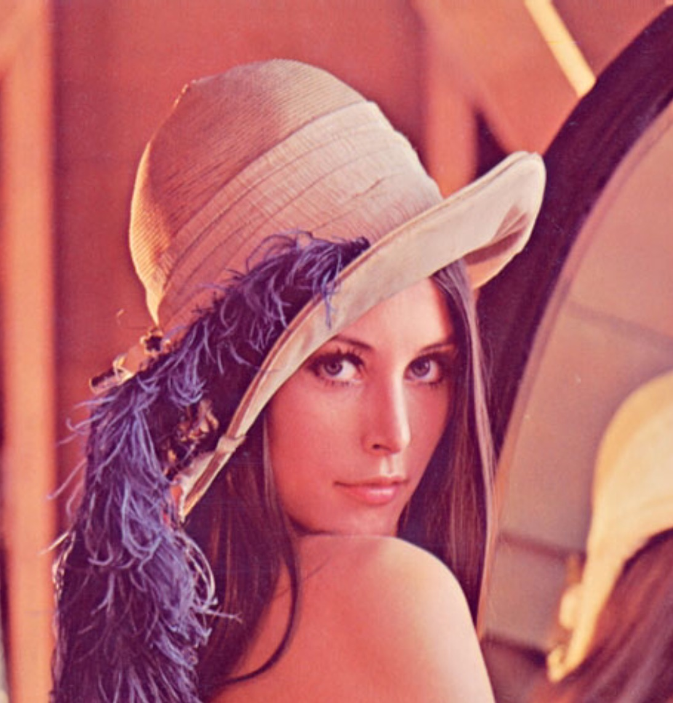
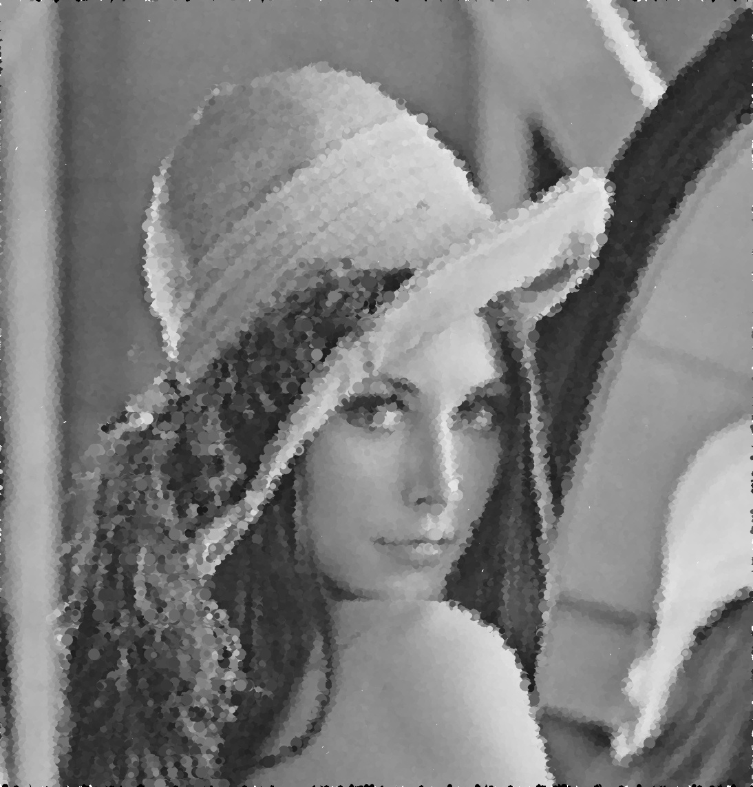

:toc: left
:linkattrs:
:source-highlighter: pygments
:figure-caption: Figura
:listing-caption: Listagem
:toc-title: Sumário
[.text-justify]

= 9ª Atividade: Pontilhismo

== Introdução

Em desenvolvimento...

=== Código no OpenCV

O código implementado pode ser visto a seguir:

.pontilhismo.cpp
[source,cpp,options="nowrap"]
----
include::pontilhismo.cpp[]
----

=== Resultados

Podemos ver o resultado da aplicação do filtro a seguir:

.Imagem de entrada

.Imagem de saída.

--
