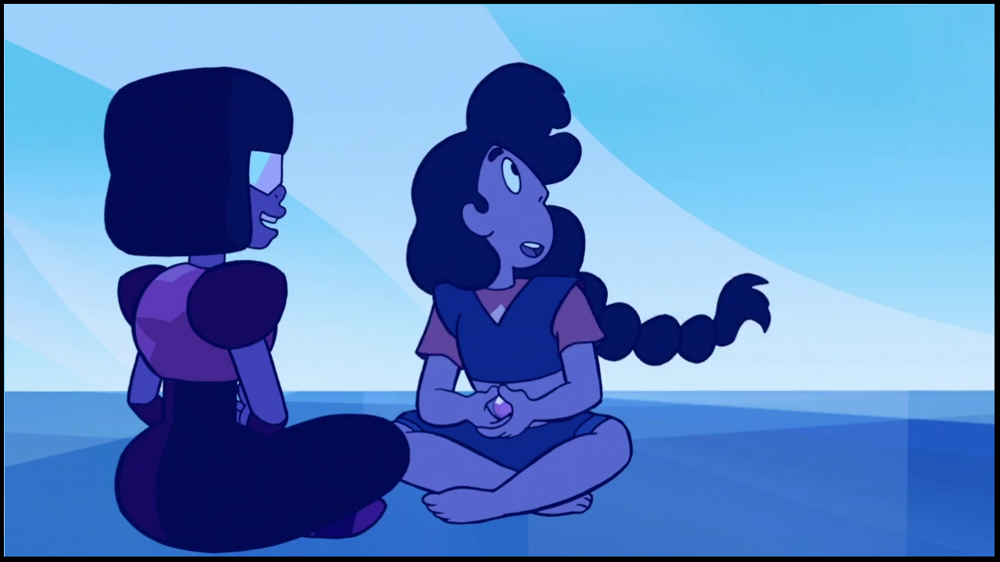
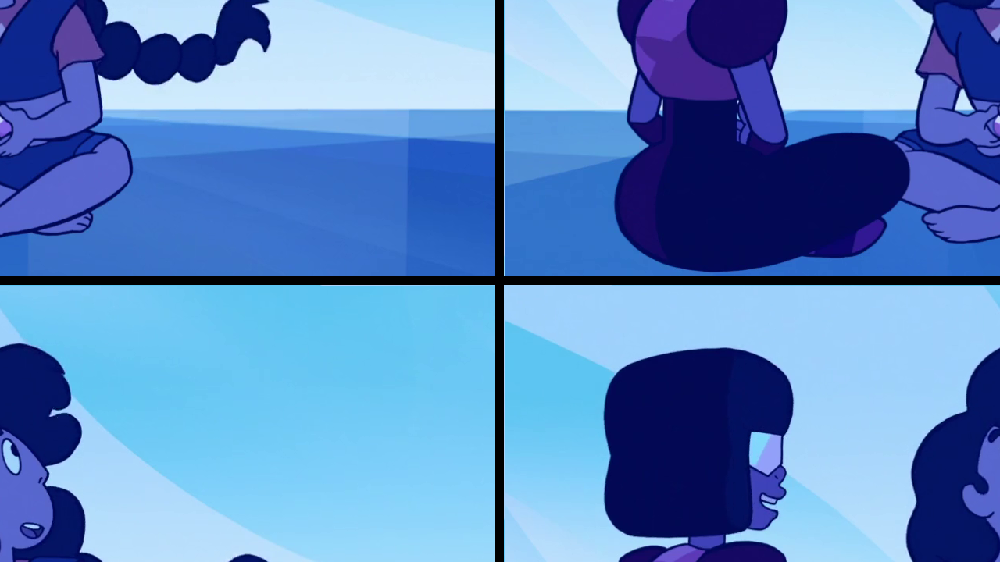

:toc: left
:linkattrs:
:source-highlighter: pygments
:figure-caption: Figura
:listing-caption: Listagem
:toc-title: Sumário
[.text-justify]

= 2ª Atividade: Troca região

O objetivo desta atividade é observar como podemos utilizar de ferramentas computacionais da biblioteca OpenCV para modificar a imagem, cortando-a em pedaços e movendo esses pedaços para outros lugares pré-destinados. Para isso, uma imagem será dividida em 4 regiões, e essas regiões serão trocadas diagonalmente.

== Desenvolvimento da atividade

A imagem a ser processada é a seguinte:

.Garnet and Stevonnie (Imagem original)

E após executar o programa, o resultado desejado é o seguinte:

--
.Garnet and Stevonnie (Regiões Trocadas)
[[Regiões_trocadas,Garnet and Stevonnie (Regiões Trocadas)]]

--

=== Código no OpenCV

A priori, fora necessário o uso de funções do OpenCV, como o "Rect" e o "CopyTo". A ideia é simples, o programa "divide" a imagem em 4 partes e realiza a troca de regiões, armazenando o resultado em uma nova imagem. Aqui, podemos perceber que trocamos da seguinte forma: quadrante superior esquerdo com o quadrante inferior direito e quadrante superior direito com o quadrante inferior esquerdo.

.trocaregiao.cpp
[source,cpp,options="nowrap"]
----
include::trocaregiao.cpp[]
----

O resultado da execução do programa pode ser observado na imagem <<Regiões_trocadas>>.